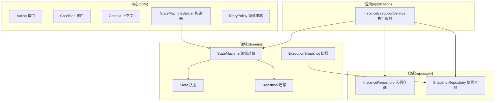
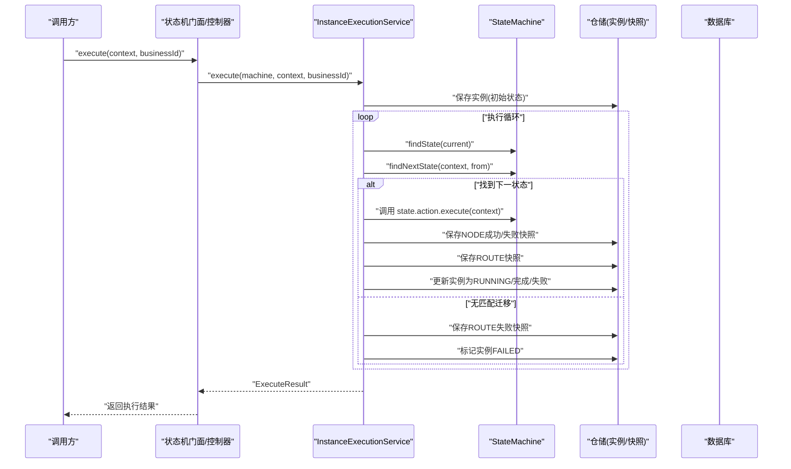
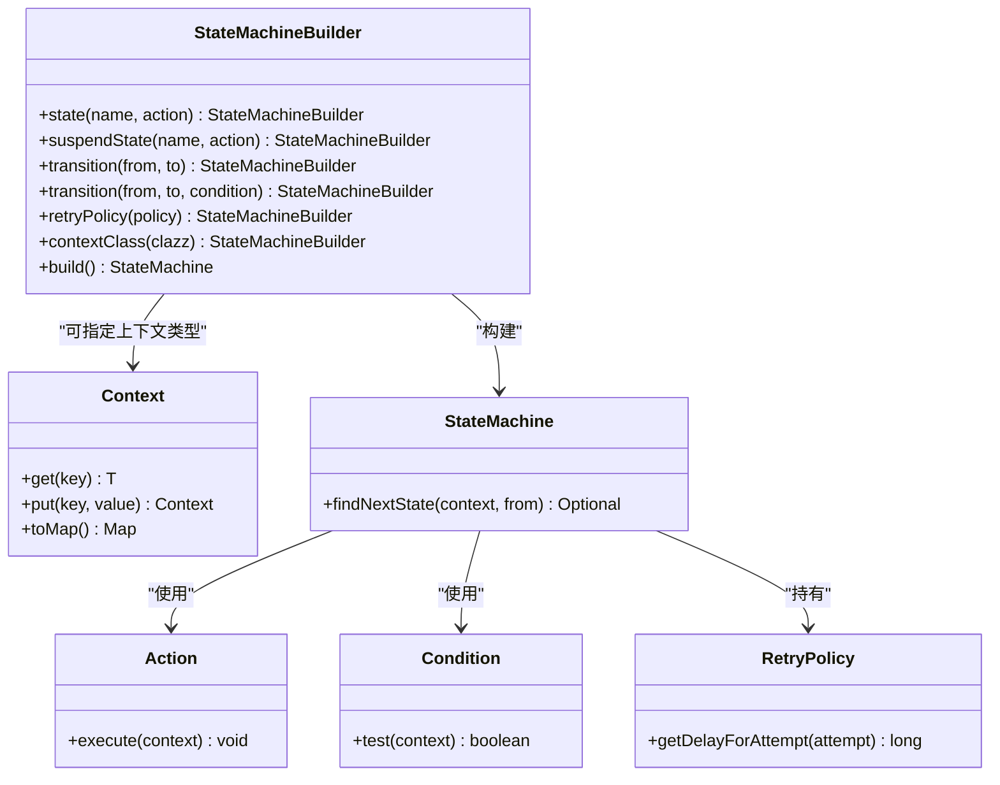
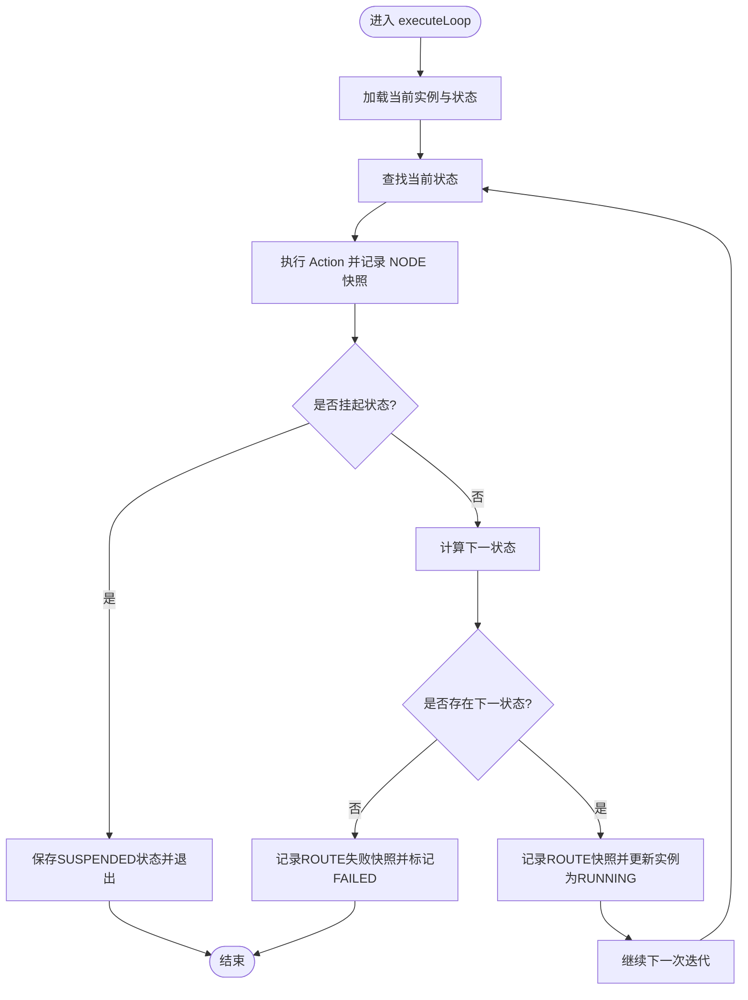
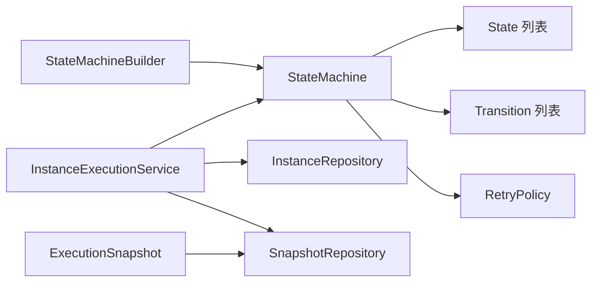

# 高级主题

<cite>
**本文引用的文件**
- [Action.java](file://state-machine-boot-starter/src/main/java/cn/chedejun/statemachine/core/Action.java)
- [Condition.java](file://state-machine-boot-starter/src/main/java/cn/chedejun/statemachine/core/Condition.java)
- [Context.java](file://state-machine-boot-starter/src/main/java/cn/chedejun/statemachine/core/Context.java)
- [StateMachineBuilder.java](file://state-machine-boot-starter/src/main/java/cn/chedejun/statemachine/core/StateMachineBuilder.java)
- [RetryPolicy.java](file://state-machine-boot-starter/src/main/java/cn/chedejun/statemachine/core/RetryPolicy.java)
- [StateMachine.java](file://state-machine-boot-starter/src/main/java/cn/chedejun/statemachine/domain/engine/StateMachine.java)
- [InstanceExecutionService.java](file://state-machine-boot-starter/src/main/java/cn/chedejun/statemachine/application/InstanceExecutionService.java)
- [InstanceRepository.java](file://state-machine-boot-starter/src/main/java/cn/chedejun/statemachine/domain/repository/InstanceRepository.java)
- [SnapshotRepository.java](file://state-machine-boot-starter/src/main/java/cn/chedejun/statemachine/domain/repository/SnapshotRepository.java)
- [ExecutionSnapshot.java](file://state-machine-boot-starter/src/main/java/cn/chedejun/statemachine/domain/snapshot/ExecutionSnapshot.java)
- [OrderContext.java](file://state-machine-demo/src/main/java/cn/chedejun/demo/statemachine/OrderContext.java)
- [OutboundContext.java](file://state-machine-demo/src/main/java/cn/chedejun/demo/statemachine/OutboundContext.java)
- [StateMachineBuilderTest.java](file://state-machine-boot-starter/src/test/java/cn/chedejun/statemachine/core/StateMachineBuilderTest.java)
- [StateMachineIntegrationTest.java](file://state-machine-boot-starter/src/test/java/cn/chedejun/statemachine/integration/StateMachineIntegrationTest.java)
</cite>

## 目录
1. [引言](#引言)
2. [项目结构](#项目结构)
3. [核心组件](#核心组件)
4. [架构总览](#架构总览)
5. [详细组件分析](#详细组件分析)
6. [依赖分析](#依赖分析)
7. [性能考虑](#性能考虑)
8. [故障排除指南](#故障排除指南)
9. [结论](#结论)
10. [附录](#附录)

## 引言
本文件面向高级用户，系统性阐述状态机框架中的高级主题：自定义 Action 与 Condition 接口的实现与扩展点设计、事务与并发控制策略、性能调优（缓存、批量、异步）、JDK 8 兼容性挑战与方案、以及故障排除与深度定制指导。内容以代码为依据，辅以图示帮助理解。

## 项目结构
项目采用分层与功能域结合的组织方式：
- core 层：定义状态机核心抽象（Action、Condition、Context、StateMachine、StateMachineBuilder、RetryPolicy 等）
- domain 层：定义领域模型（StateMachine、State、Transition、ExecutionSnapshot 等）
- application 层：应用服务（InstanceExecutionService），编排执行、重试、路由与持久化
- infrastructure/persistence 居中于数据访问层（JDBC 实现）
- demo 展示如何在业务上下文中扩展 Context 子类

**图表来源**
- [StateMachineBuilder.java:1-52](file://state-machine-boot-starter/src/main/java/cn/chedejun/statemachine/core/StateMachineBuilder.java#L1-L52)
- [StateMachine.java:1-77](file://state-machine-boot-starter/src/main/java/cn/chedejun/statemachine/domain/engine/StateMachine.java#L1-L77)
- [InstanceExecutionService.java:1-296](file://state-machine-boot-starter/src/main/java/cn/chedejun/statemachine/application/InstanceExecutionService.java#L1-L296)
- [ExecutionSnapshot.java:1-73](file://state-machine-boot-starter/src/main/java/cn/chedejun/statemachine/domain/snapshot/ExecutionSnapshot.java#L1-L73)

**章节来源**
- [StateMachineBuilder.java:1-52](file://state-machine-boot-starter/src/main/java/cn/chedejun/statemachine/core/StateMachineBuilder.java#L1-L52)
- [StateMachine.java:1-77](file://state-machine-boot-starter/src/main/java/cn/chedejun/statemachine/domain/engine/StateMachine.java#L1-L77)
- [InstanceExecutionService.java:1-296](file://state-machine-boot-starter/src/main/java/cn/chedejun/statemachine/application/InstanceExecutionService.java#L1-L296)

## 核心组件
- Action：无返回值的函数式接口，用于在状态节点内执行业务逻辑；通过 Context 读写共享状态，结果会自动记录到快照。
- Condition：无副作用的判定接口，用于在迁移时根据上下文决定是否允许流转。
- Context：键值存储的上下文容器，默认支持 Map 化与序列化，便于跨状态传递数据。
- StateMachineBuilder：链式构建器，负责装配状态、迁移、重试策略、上下文类型、JdbcTemplate 与注册表等。
- RetryPolicy：指数回退重试策略，支持最大次数、初始延迟、最大延迟与回退因子。
- StateMachine：不可变领域对象，持有状态集合、迁移集合、重试策略与上下文类型，提供路由决策能力。
- InstanceExecutionService：执行引擎，封装状态执行、重试、路由、快照与实例状态变更，含挂起/恢复与重试流程。
- ExecutionSnapshot：不可变快照聚合根，区分 NODE 与 ROUTE 两类快照，记录输入输出、状态、错误信息与尝试次数。

**章节来源**
- [Action.java:1-12](file://state-machine-boot-starter/src/main/java/cn/chedejun/statemachine/core/Action.java#L1-L12)
- [Condition.java:1-7](file://state-machine-boot-starter/src/main/java/cn/chedejun/statemachine/core/Condition.java#L1-L7)
- [Context.java:1-24](file://state-machine-boot-starter/src/main/java/cn/chedejun/statemachine/core/Context.java#L1-L24)
- [StateMachineBuilder.java:1-52](file://state-machine-boot-starter/src/main/java/cn/chedejun/statemachine/core/StateMachineBuilder.java#L1-L52)
- [RetryPolicy.java:1-45](file://state-machine-boot-starter/src/main/java/cn/chedejun/statemachine/core/RetryPolicy.java#L1-L45)
- [StateMachine.java:1-77](file://state-machine-boot-starter/src/main/java/cn/chedejun/statemachine/domain/engine/StateMachine.java#L1-L77)
- [InstanceExecutionService.java:1-296](file://state-machine-boot-starter/src/main/java/cn/chedejun/statemachine/application/InstanceExecutionService.java#L1-L296)
- [ExecutionSnapshot.java:1-73](file://state-machine-boot-starter/src/main/java/cn/chedejun/statemachine/domain/snapshot/ExecutionSnapshot.java#L1-L73)

## 架构总览
状态机执行路径从应用服务开始，经由领域对象进行路由决策，调用 Action 执行业务，生成快照并更新实例状态。迁移条件由 Condition 决定，重试策略由 RetryPolicy 控制。

**图表来源**
- [InstanceExecutionService.java:43-193](file://state-machine-boot-starter/src/main/java/cn/chedejun/statemachine/application/InstanceExecutionService.java#L43-L193)
- [StateMachine.java:63-71](file://state-machine-boot-starter/src/main/java/cn/chedejun/statemachine/domain/engine/StateMachine.java#L63-L71)
- [ExecutionSnapshot.java:38-61](file://state-machine-boot-starter/src/main/java/cn/chedejun/statemachine/domain/snapshot/ExecutionSnapshot.java#L38-L61)

## 详细组件分析

### 自定义 Action 与 Condition 的实现与扩展点
- 设计原则
  - Action 无返回值，通过 Context 写入共享状态，确保状态变更可被序列化与持久化，便于可观测与回放。
  - Condition 无副作用，仅基于上下文判断，保证路由决策的确定性与幂等性。
  - StateMachineBuilder 提供 fluent API，支持 suspendState 标记挂起点，配合应用服务的 resume 流程实现人工干预。
  - RetryPolicy 可插拔，支持指数回退、最大尝试次数与延迟上限，避免对下游造成雪崩。
- 最佳实践
  - 在 Action 中避免阻塞 IO；如需外部调用，建议结合异步与超时策略。
  - 将复杂路由逻辑下沉至 Context 或专用校验器，保持 Condition 简洁。
  - 对关键状态的 Action 做幂等处理，结合快照 attempt 字段进行去重。
  - 使用自定义 Context 子类承载业务属性，提升类型安全与可读性。

**图表来源**
- [Action.java:9-10](file://state-machine-boot-starter/src/main/java/cn/chedejun/statemachine/core/Action.java#L9-L10)
- [Condition.java:4-5](file://state-machine-boot-starter/src/main/java/cn/chedejun/statemachine/core/Condition.java#L4-L5)
- [Context.java:6-23](file://state-machine-boot-starter/src/main/java/cn/chedejun/statemachine/core/Context.java#L6-L23)
- [StateMachineBuilder.java:28-46](file://state-machine-boot-starter/src/main/java/cn/chedejun/statemachine/core/StateMachineBuilder.java#L28-L46)
- [RetryPolicy.java:26-30](file://state-machine-boot-starter/src/main/java/cn/chedejun/statemachine/core/RetryPolicy.java#L26-L30)
- [StateMachine.java:63-71](file://state-machine-boot-starter/src/main/java/cn/chedejun/statemachine/domain/engine/StateMachine.java#L63-L71)

**章节来源**
- [Action.java:1-12](file://state-machine-boot-starter/src/main/java/cn/chedejun/statemachine/core/Action.java#L1-L12)
- [Condition.java:1-7](file://state-machine-boot-starter/src/main/java/cn/chedejun/statemachine/core/Condition.java#L1-L7)
- [Context.java:1-24](file://state-machine-boot-starter/src/main/java/cn/chedejun/statemachine/core/Context.java#L1-L24)
- [StateMachineBuilder.java:1-52](file://state-machine-boot-starter/src/main/java/cn/chedejun/statemachine/core/StateMachineBuilder.java#L1-L52)
- [RetryPolicy.java:1-45](file://state-machine-boot-starter/src/main/java/cn/chedejun/statemachine/core/RetryPolicy.java#L1-L45)
- [StateMachine.java:1-77](file://state-machine-boot-starter/src/main/java/cn/chedejun/statemachine/domain/engine/StateMachine.java#L1-L77)

### 事务管理与并发控制策略
- 事务边界
  - 执行循环与状态切换在应用服务中进行，每个状态 Action 的执行与快照写入构成一个原子单元；失败时记录失败快照并按重试策略延时后再次尝试。
- 并发控制
  - 恢复流程采用 CAS 式原子更新：仅当实例处于 SUSPENDED 且目标下一状态正确时，才将其置为 RUNNING，避免并发恢复导致的状态竞争。
  - 挂起点通过 suspendState 标记，结合 resumeByBusinessId/resumeByInstanceId 与预期状态校验，确保恢复的安全性。
- 错误处理
  - 当无可用迁移时，记录 ROUTE 失败快照并标记实例 FAILED，同时抛出异常，避免无限循环。
  - 最大迭代次数受状态数与重试次数上界约束，防止执行风暴。

**图表来源**
- [InstanceExecutionService.java:158-193](file://state-machine-boot-starter/src/main/java/cn/chedejun/statemachine/application/InstanceExecutionService.java#L158-L193)
- [InstanceRepository.java:14-17](file://state-machine-boot-starter/src/main/java/cn/chedejun/statemachine/domain/repository/InstanceRepository.java#L14-L17)

**章节来源**
- [InstanceExecutionService.java:119-152](file://state-machine-boot-starter/src/main/java/cn/chedejun/statemachine/application/InstanceExecutionService.java#L119-L152)
- [InstanceExecutionService.java:158-193](file://state-machine-boot-starter/src/main/java/cn/chedejun/statemachine/application/InstanceExecutionService.java#L158-L193)
- [InstanceRepository.java:1-26](file://state-machine-boot-starter/src/main/java/cn/chedejun/statemachine/domain/repository/InstanceRepository.java#L1-L26)

### 性能调优指南
- 缓存策略
  - 定义缓存：将 StateMachine 的定义（states、transitions、retryPolicy）缓存于内存注册表，避免重复构建与数据库查询。
  - 上下文序列化缓存：对频繁使用的上下文对象进行序列化/反序列化优化，减少 Jackson 开销。
- 批量处理
  - 批量执行：在应用服务层面聚合多个实例的执行批次，减少数据库往返；注意每个实例内部仍遵循原子性与一致性。
  - 快照批量写入：在单次执行中合并多次 NODE/ROUTE 快照写入，降低 I/O 压力。
- 异步执行
  - Action 异步化：将外部调用（HTTP、消息队列）改为异步回调，结合超时与补偿机制。
  - 执行线程池：为重试与恢复流程配置独立线程池，避免阻塞主线程。
- 重试与退避
  - 合理设置最大尝试次数与回退因子，避免对下游系统造成压力峰值。
  - 对瞬时性错误（网络抖动、限流）采用指数回退，对永久性错误（参数错误）快速失败。

**章节来源**
- [StateMachineBuilder.java:14-17](file://state-machine-boot-starter/src/main/java/cn/chedejun/statemachine/core/StateMachineBuilder.java#L14-L17)
- [RetryPolicy.java:18-43](file://state-machine-boot-starter/src/main/java/cn/chedejun/statemachine/core/RetryPolicy.java#L18-L43)
- [InstanceExecutionService.java:200-237](file://state-machine-boot-starter/src/main/java/cn/chedejun/statemachine/application/InstanceExecutionService.java#L200-L237)

### JDK 8 兼容性与解决方案
- 挑战
  - Java 8 不支持某些较新的 API（如特定的流 API 变体、时间单位工具等），需要在兼容模式下编写代码。
- 方案
  - 使用标准的流 API 与时间单位转换（通过 TimeUnit.toMillis），确保在 Java 8 下编译与运行。
  - 在测试与集成环境中，优先使用兼容的驱动与方言（例如 MySQL 8+ 的驱动与方言配置）。
  - 对反射与泛型的使用保持简洁，避免引入高版本特性。

**章节来源**
- [RetryPolicy.java:32-43](file://state-machine-boot-starter/src/main/java/cn/chedejun/statemachine/core/RetryPolicy.java#L32-L43)
- [StateMachineIntegrationTest.java:60-68](file://state-machine-boot-starter/src/test/java/cn/chedejun/statemachine/integration/StateMachineIntegrationTest.java#L60-L68)

### 深度定制与扩展指导
- 自定义上下文
  - 通过继承 Context 或直接使用 Context.put/get，扩展业务字段与行为；demo 展示了订单与出库单上下文的扩展方式。
- 自定义 Action/Condition
  - 将复杂逻辑封装为可复用的 Action/Condition 实现，注入到 StateMachineBuilder 的 state/transition 中。
- 注册与版本管理
  - 使用 StateMachineRegistry 管理多版本状态机定义，结合 DefinitionRepository 持久化与查询。
- 监控与可观测性
  - 借助 ExecutionSnapshot 的 NODE/ROUTE 类型与 attempt 字段，构建审计与追踪；结合管理端点与控制台查看实例与快照详情。

**章节来源**
- [OrderContext.java:1-99](file://state-machine-demo/src/main/java/cn/chedejun/demo/statemachine/OrderContext.java#L1-L99)
- [OutboundContext.java:1-43](file://state-machine-demo/src/main/java/cn/chedejun/demo/statemachine/OutboundContext.java#L1-L43)
- [StateMachineBuilderTest.java:51-60](file://state-machine-boot-starter/src/test/java/cn/chedejun/statemachine/core/StateMachineBuilderTest.java#L51-L60)

## 依赖分析
核心模块之间的依赖关系清晰：应用服务依赖领域对象与仓储接口；领域对象依赖核心抽象；构建器负责装配领域对象。

**图表来源**
- [StateMachineBuilder.java:42-46](file://state-machine-boot-starter/src/main/java/cn/chedejun/statemachine/core/StateMachineBuilder.java#L42-L46)
- [StateMachine.java:23-40](file://state-machine-boot-starter/src/main/java/cn/chedejun/statemachine/domain/engine/StateMachine.java#L23-L40)
- [InstanceExecutionService.java:30-41](file://state-machine-boot-starter/src/main/java/cn/chedejun/statemachine/application/InstanceExecutionService.java#L30-L41)
- [ExecutionSnapshot.java:11-36](file://state-machine-boot-starter/src/main/java/cn/chedejun/statemachine/domain/snapshot/ExecutionSnapshot.java#L11-L36)

**章节来源**
- [StateMachineBuilder.java:1-52](file://state-machine-boot-starter/src/main/java/cn/chedejun/statemachine/core/StateMachineBuilder.java#L1-L52)
- [StateMachine.java:1-77](file://state-machine-boot-starter/src/main/java/cn/chedejun/statemachine/domain/engine/StateMachine.java#L1-L77)
- [InstanceExecutionService.java:1-296](file://state-machine-boot-starter/src/main/java/cn/chedejun/statemachine/application/InstanceExecutionService.java#L1-L296)
- [ExecutionSnapshot.java:1-73](file://state-machine-boot-starter/src/main/java/cn/chedejun/statemachine/domain/snapshot/ExecutionSnapshot.java#L1-L73)

## 性能考虑
- I/O 优化
  - 将 NODE/ROUTE 快照批量写入，减少数据库往返。
  - 使用 tryMarkRunningFromSuspended 原子更新，避免轮询与竞态。
- CPU 优化
  - 在 Action 中避免阻塞操作；必要时使用异步与线程池。
  - 合理设置重试策略，避免过长的等待时间占用资源。
- 内存与序列化
  - 对 Context 进行必要的字段裁剪，避免序列化大对象。
  - 对热点上下文进行缓存，减少反序列化成本。

[本节为通用性能建议，无需具体文件引用]

## 故障排除指南
- 常见问题
  - 状态未找到：检查 StateMachine 的 states 是否正确构建，或 Action 是否提前抛出异常导致实例被标记为 FAILED。
  - 无可用迁移：确认 Transition 的 Condition 是否始终返回 false，或上下文状态是否满足条件。
  - 恢复失败：确保预期状态与实例当前状态一致，且实例处于 SUSPENDED。
  - 重试中断：线程中断会触发异常，需在调用方妥善处理。
- 诊断方法
  - 查看快照类型与状态：NODE 成功/失败、ROUTE 成功/失败，定位具体环节。
  - 校验实例状态：COMPLETED、RUNNING、SUSPENDED、FAILED 的流转是否符合预期。
  - 检查最大迭代次数：超过上界会抛出异常，排查是否存在环路或条件不当。
- 解决方案
  - 修正 Condition 逻辑或补充上下文数据。
  - 调整重试策略与最大尝试次数。
  - 使用 resumeByInstanceId/resumeByBusinessId 与 contextMerger 修正上下文后继续执行。

**章节来源**
- [InstanceExecutionService.java:166-193](file://state-machine-boot-starter/src/main/java/cn/chedejun/statemachine/application/InstanceExecutionService.java#L166-L193)
- [InstanceExecutionService.java:268-275](file://state-machine-boot-starter/src/main/java/cn/chedejun/statemachine/application/InstanceExecutionService.java#L268-L275)
- [ExecutionSnapshot.java:38-61](file://state-machine-boot-starter/src/main/java/cn/chedejun/statemachine/domain/snapshot/ExecutionSnapshot.java#L38-L61)

## 结论
本框架通过清晰的抽象与稳健的执行模型，提供了高度可扩展的状态机实现。通过合理使用 Action/Condition、完善的重试与快照机制、以及严格的并发控制，可在生产环境稳定运行。高级用户可在此基础上进一步定制上下文、扩展 Action/Condition、优化性能并增强可观测性。

[本节为总结性内容，无需具体文件引用]

## 附录
- 关键流程回顾
  - 构建阶段：使用 StateMachineBuilder 配置状态、迁移、重试策略与上下文类型。
  - 执行阶段：应用服务驱动状态执行、路由与快照记录，结合重试策略处理失败。
  - 恢复阶段：CAS 原子更新实例状态，结合上下文合并继续执行。
- 参考测试
  - 单元测试覆盖构建器、挂起/恢复、路由失败等场景。
  - 集成测试覆盖端到端执行、重试、控制台 API 与 Actuator 端点。

**章节来源**
- [StateMachineBuilderTest.java:35-163](file://state-machine-boot-starter/src/test/java/cn/chedejun/statemachine/core/StateMachineBuilderTest.java#L35-L163)
- [StateMachineIntegrationTest.java:225-482](file://state-machine-boot-starter/src/test/java/cn/chedejun/statemachine/integration/StateMachineIntegrationTest.java#L225-L482)